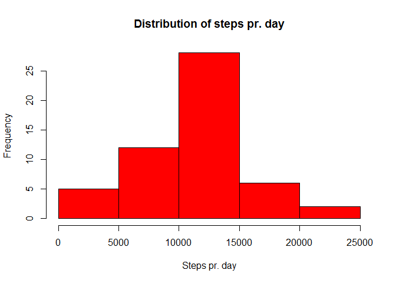
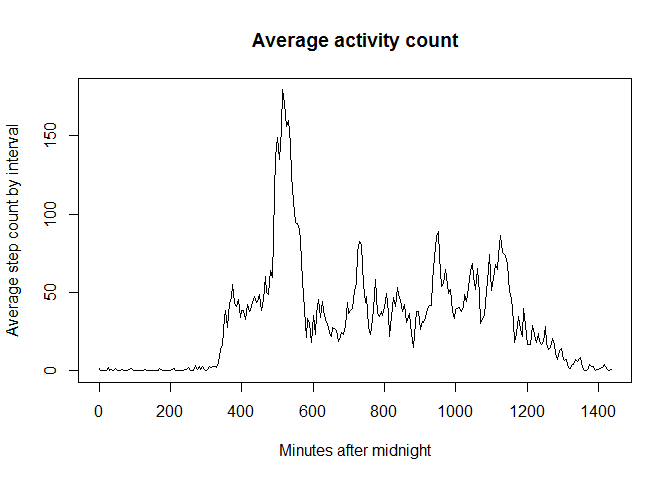
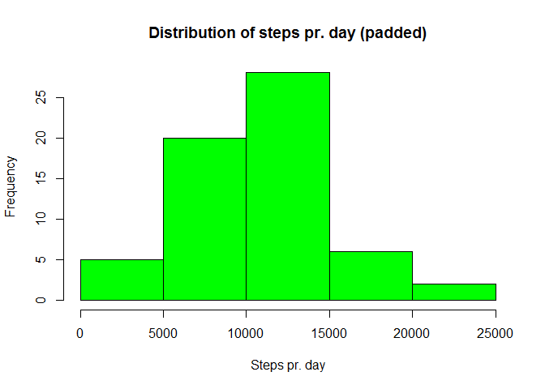
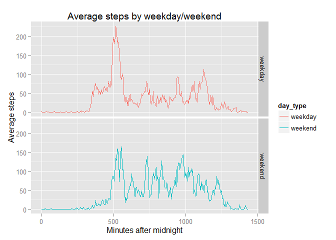

# Reproducible Research: Peer Assessment 1
  
# Introduction
It is now possible to collect a large amount of data about personal movement using activity monitoring devices such as a Fitbit, Nike Fuelband, or Jawbone Up. These type of devices are part of the "quantified self" movement - a group of enthusiasts who take measurements about themselves regularly to improve their health, to find patterns in their behavior, or because they are tech geeks. But these data remain under-utilized both because the raw data are hard to obtain and there is a lack of statistical methods and software for processing and interpreting the data.

## Loading and preprocessing the data
The data are found in the zipped file "activity.zip". Unzip it:

```r
unzip("activity.zip")
```

Read the unzipped csv file into a data frame:


```r
amd <- read.csv("activity.csv")
```
Preview the data:

```r
head(amd)
```

```
##   steps       date interval
## 1    NA 2012-10-01        0
## 2    NA 2012-10-01        5
## 3    NA 2012-10-01       10
## 4    NA 2012-10-01       15
## 5    NA 2012-10-01       20
## 6    NA 2012-10-01       25
```

## What is mean total number of steps taken per day?
Use the dplyr package:


```r
library(dplyr, warn.conflicts = FALSE)
```

Extract the total number of steps by date:


```r
steps_by_date <- amd %>%
  group_by(date) %>%
  summarize(total_steps = sum(steps))
```

View the corresponding histogram:


```r
hist(steps_by_date$total_steps,
     main = "Distribution of steps pr. day",
     xlab = "Steps pr. day",
     col = "red")
```

 

Find the mean number of steps pr. day:


```r
mean(steps_by_date$total_steps, na.rm = TRUE)
```

```
## [1] 10766.19
```

Find the median number of steps pr. day:


```r
median(steps_by_date$total_steps, na.rm = TRUE)
```

```
## [1] 10765
```

The mean and median are almost equal, which indicates an approximately symmetric distribution, which is also supported by the histogram above.

## What is the average daily activity pattern?
Calculate daily average for each activity by day, by first summing over groupings of date/interval and then averaging:


```r
act_pattern <- amd %>%
  group_by(date, interval) %>%
  summarize(total_steps = sum(steps, na.rm = TRUE)) %>%
  group_by(interval) %>%
  summarize(avg_by_interval = mean(total_steps))
```

Do note, that the intervals are measured in a "(h)h:mm" format. To we need a function to turn it into minutes. This is achieved using the div (%/%) and modulo (%%) operators:


```r
minute_count <- function(i) {
  (i %/% 100) * 60 + i %% 100
  }
```

The minutes function can now be applied to the intervals to yield a new column in the data frame:


```r
act_pattern <- mutate(act_pattern, minutes = minute_count(interval))
```
Finally, a plot can be made:


```r
plot(act_pattern$minutes,
     act_pattern$avg_by_interval,
     type = "l",
     main = "Average activity count",
     xlab = "Minutes after midnight",
     ylab = "Average step count by interval")
```

 

Find the position of the maximum activity count using which.max:

```r
which.max(act_pattern$avg_by_interval)
```

```
## [1] 104
```

Since the first position corresponds to 0 minutes, the second to 5 minutes and so on, the minute count for the maximum must be:


```r
(which.max(act_pattern$avg_by_interval) - 1) * 5
```

```
## [1] 515
```

This corresponds to 8:35 am.

## Imputing missing values

Count the total number of NA's in the dataset:


```r
sum(is.na(amd$steps))
```

```
## [1] 2304
```

This is quite a lot compared to the size of the dataset (17568).

As an attempt to remedy this, let's replace the NA's by the mean value for the time interval (as computed in the last section).  
Applying the same logic as when finding the maximum, but this time in reverse, the corresponding data entry in the data must be the minute count divided by 5 and adding 1 in the end. Make a data frame with this value included:


```r
amd2 <- mutate(amd,
               interval_avg =
                 act_pattern$avg_by_interval[minute_count(interval)/5 +1])
```

Make a function that chooses between actual steps value and average value:


```r
choose <- function(steps, avg) {
  if (is.na(steps)) avg else steps
}
```

Now apply this function using mapply to make a new column:


```r
steps_padded <- mapply(choose, amd2$steps, amd2$interval_avg)
```

Make a new data fram with the padded data:


```r
amd_padded <- cbind(amd, steps_padded) %>%
  select(steps_padded, date, interval)
```

(I'm sure there's a more elegant way to do this than the last two steps, but this works ...)  
  
Now we can follow the same steps as in the first section. Extract the total number of steps by date:


```r
steps_by_date <- amd_padded %>%
  group_by(date) %>%
  summarize(total_steps = sum(steps_padded))
```

View the corresponding histogram:


```r
hist(steps_by_date$total_steps,
     main = "Distribution of steps pr. day (padded)",
     xlab = "Steps pr. day",
     col = "green")
```

 

Find the mean number of steps pr. day:


```r
mean(steps_by_date$total_steps, na.rm = TRUE)
```

```
## [1] 10581.01
```

Find the median number of steps pr. day:


```r
median(steps_by_date$total_steps, na.rm = TRUE)
```

```
## [1] 10395
```

Both are lower than the originally calculated values, but the symmetric tendency is intact.

## Are there differences in activity patterns between weekdays and weekends?

Make a vector of (English) weekday names:


```r
Sys.setlocale("LC_TIME", "English")
```

```
## [1] "English_United States.1252"
```

```r
days <- weekdays(as.Date(amd_padded$date))
```

Make a function that designates weekdays and weekends:

```r
day_typ <- function(day) {
  if (day == "Saturday" | day == "Sunday") {
    "weekend"
  } else {
    "weekday"
  }
}
```

Apply to days vector and turn into factor:

```r
day_type <- as.factor(sapply(days, day_typ))
```

Make data frame:

```r
amd_day <- cbind(amd_padded, day_type)
```

Calculate mean number of steps grouped by interval and type of day:


```r
amd_by_day <- amd_day %>%
  group_by(day_type, interval) %>%
  summarize(mean_steps = mean(steps_padded))
```

Use the ggplot2 package to make panel plot:

```r
library(ggplot2)
qplot(minute_count(interval), mean_steps,
      data = amd_by_day,
      facets = day_type ~ .,
      geom = "line",
      color = day_type,
      main = "Average steps by weekday/weekend",
      xlab = "Minutes after midnight",
      ylab = "Average steps")
```

 
  
On weekends, the average numbers of steps is generally lower. In particular, the early observations are drastically reduced.
